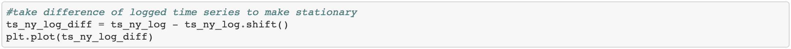

# Real_Estate_Dashboard
Project 3 Rice FinTech Bootcamp

# Goal & Motivation
Our ultimate goal and motivation for this project was to manipulate housing market data and present the trends in a visually pleasing way that make clear and concise sense. 

# Approach & Steps
Our overall goal was to focus on the core of what we learned in class- data analytics and visualization skills. 
In addition, we felt that these were skills that could be applied in broad strokes in many different real life roles, whereas machine learning and blockchain are more specialized and might not be utilized by everyone in the cohort moving forward. The topic of real estate seemed relevant and promising, with lots of data available on the subject. 
Then came finding the data. We scoured Kaggle, multiple government websites, and more to try and find any and all housing market data. We took the best data we could find and then used that to decide on which variables we would focus on to make up our project. 
We then spent an inordinate amount of time cleaning the data so that it was all comparable. 
Then we used historicals to visualize current trends and forecasted these trends moving forward. 
Finally, all of these elements were compiled into a beautiful Dashboard to show our findings.

# Data
## HPI
The housing price index data came from Freddie Mac, which was chartered by Congress in 1970 to support the U.S. housing finance system, and is one of the largest entities in this arena. The index provides a measure of price inflation for homes across the U.S., and is calculated monthly.

## Population, Employment, and Personal Income
Population, Employment, and Personal Income information came from the Bureau of Economic Analysis website, so this data is very legitimate. he biggest issue was that the data was transposed the wrong way. There were individual columns for each value. We needed the data with one year per row per MSA. There were lots of extra rows with summary information that was irrelevant. 

## Latitude & Longitude
Latitude and Longitude by MSA was hard to find. There was a lot of work done trying to match lat and lon to county codes and then map those county codes to the GeoFips codes that we were going by for the other data. This produced only 4 matches out of the top 20 MSAs that we wanted. Many raw datasets contained lots of extra characters, MSA names were different. For example, the DFW MSA was named Dallas-Fort Worth- Arlington, TX in some datasets and Dallas-Fort Worth- Irving, TX in others. Merging the data that we had for HPI, Population, Employment, and Personal Income with the latitude longitude data proved difficult. Ultimately, we discovered a dataset from opendatasoft that contained latitude and longitude data as well as MSA data for nearly 2,000 places. MSA data is defined by the Office of Managemnet and Budget and consists of the county or counties associated with at least one urban core plus adjacent counties have a high degree of social and economic integration with the core. The dataset came from the year 2018. Latitude and Longitude data types had to be changed so that the mapbox API could read it.

# Methods & Technology
We used monthly data from 1975 in an ARIMA model to predict the housing price index for the next 18 months for the top 5 MSAs.  

We wanted to provide near-term forecasts for the top 5 MSAs to give a semblance of what the markets of these areas might look like if current trends were to continue. To do this we used monthly data from 1975 to predict the housing price index for the next 18 months. We decided to use the entire dataset instead of just the data from 2000 to present to allow for more data points. Our overall goal was not to construct the most accurate forecast ever seen, but more to provide a good representation of where housing prices might be headed, to allow for better insights. 

Because the data was non-stationary, and had trend and seasonal components within, an ARIMA model was used. To remove/reduce the trend we first performed a logarithmic transformation on the data. Next we differenced the data to confirm it was stationary. After this was complete, the ACF and PACF were used to determine the significant lags and formulate what our model structure would be. The final or best fitting model was an ARIMA (5,1,3), and was determined after comparing the AIC and BIC of numerous different models, while also confirming that all coefficients were significant. 

Results of Model Summary

Using info to forecast 2021

## Dashboard
Our Dashboard is made up of the following tabs:
* Overview:
Map of Top 20 MSA locations by Population using plotly's mapbox. 

* Historical: We show Average Housing Price index per year in the US, and then individual graphs for the housing prices, personal income, employment, and population per MSA for the years 2000-2019.

* Correlations: all of these factors are highly correlated with the Housing Price Index. 

* Forecasts

# Evaluation
This Dashboard is a tool to help in understanding how this handful of variables interact with housing prices. Someone could use this tool to realize the state of the housing market. 